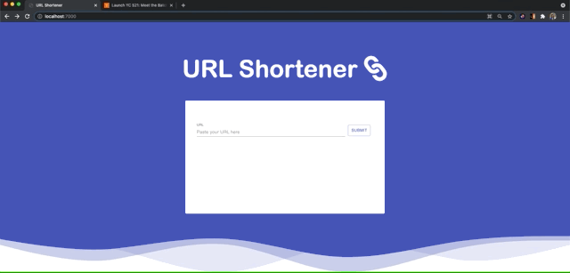

# Url Shortener
### Table of Contents
1. [General Info](#🌴-General-Info)
2. [Demo](#✨-Demo)
3. [Technologies](#🧪-Technologies)
4. [Installation](#🚀-Installation)
5. [Contributors](#🤝-Contributors)


### General Info
Url Shortener is a single-page application that allows users to transform a long url into a short url that redirects to the original url when used. 

### ✨ Demo
Copy and paste url into the input


<br />

### 🧪 Technologies
* Font-Awesome : Version 1.2.36
* Material-ui : Version 4.12.3,
* Express : Version 4.17.1,
* Mongoose : Version 5.13.5,
* React : Version 17.0.2,
* React-dom : Version 17.0.2,
* Save : Version 2.4.0,
* Shortid : Version 2.2.16,
* Valid-url : Version 1.0.9

### 🚀 Installation and Setup
```
$ git clone https://github.com/lkamphaus/url-shortener.git
$ cd ../url-shortener
$ npm install
$ npm run dev
$ npm start
```


### 🤝 Contributors
- [Laura Kamphaus](https://github.com/lkamphaus)


